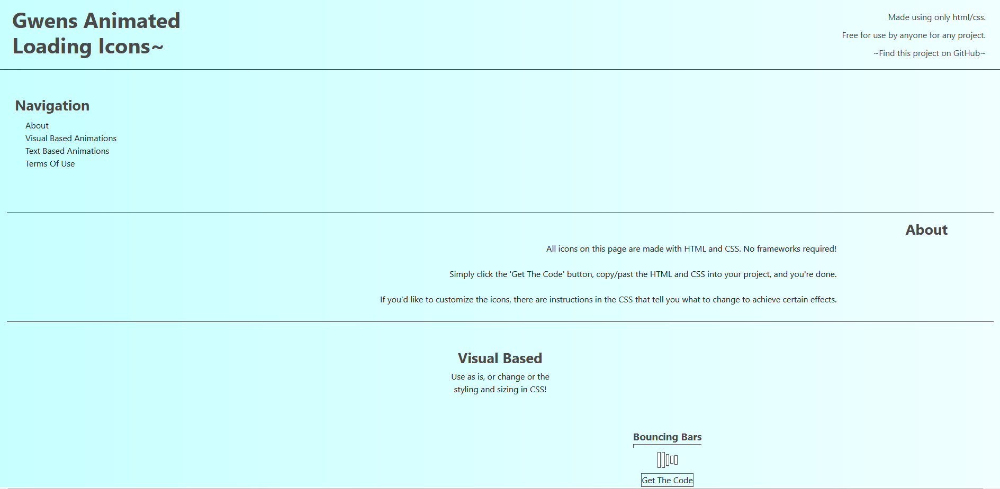

# Gwens-Free-Loading-Icons

* [About](#about)
* [Technical Information](#technical-information)
* [Terms Of Use](#terms-of-use)
* [About Me](#about-me)

## About

It's a bunch of loading icons made with only HTML and CSS! All icons are free to use and open source under the Apache 2.0 License. Just open the site with the link below, find the icon you want to use, and hit the 'Get The Code' button.

### [Gwens Free Loading Icons](http://heyitsgwen.github.io/Free-Loading-Icons/index.html)

Each icon is ready to use, just copy and paste the HTML and CSS into your project and move on to more important things. There are also instructions contained within the CSS, so they can be customized and styled to your specific needs.

## Technical Information

All icon animations are made with only HTML and CSS using animation keyframes. The website itself is made with bootstrap, for the layout, and jquery, for the 'Get The Code' box functionality.

## Terms Of Use

These icons are all free to use for any project, and are open source under the [Apache 2.0 Licence.](https://www.apache.org/licenses/LICENSE-2.0) Feel free to credit me if you'd like, but it's not at all necessary to do so to use these icons. Just make sure you're not using them for evil... :smiling_imp:

## About Me

My name is Gwen, as you might have guessed. I'm a developer in training at Microverse, an online school for software development. I've also learned from Free Code Camp, Codeacademy, and a few W3 courses.

My Github: [HeyItsGwen](https://github.com/HeyItsGwen)
My LinkedIn: [Gwen Hey](https://www.linkedin.com/in/gwen-hey-642109191/)
